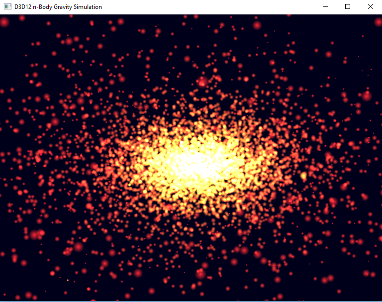

# Direct3D 12 n-body gravity sample

This sample demonstrates the use of asynchronous compute shaders (multi-engine) to do anything. Graphics commands and compute commands can be recorded simultaneously, and submitted to their respective command queues when the work is ready to begin execution on the GPU. This sample also demonstrates advanced usage of fences to synchronize tasks across command queues.

This sample is copied from D3D12nBodyGravity.

### Optional features
This sample has been updated to build against the Windows 10 Anniversary Update SDK. In this SDK a new revision of Root Signatures is available for Direct3D 12 apps to use. Root Signature 1.1 allows for apps to declare when descriptors in a descriptor heap won't change or the data descriptors point to won't change.  This allows the option for drivers to make optimizations that might be possible knowing that something (like a descriptor or the memory it points to) is static for some period of time.